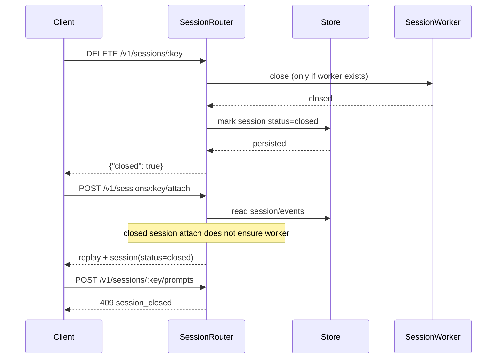

# Hivebeam Gateway Architecture

This document describes the current gateway architecture, what is enforced today, and the next implementation order.

## 1. Scope

Hivebeam is an ACP gateway that exposes HTTP/WebSocket APIs and runs provider bridges (Codex/Claude) behind a unified session model.

Current focus:
- Single-node reliability.
- Central policy and sandbox enforcement.
- Contract-stable `/v1` API surface.

## 2. Runtime Topology

- One OTP application (`Hivebeam.Application`).
- One gateway supervision tree (`Hivebeam.Gateway.Supervisor`).
- Dynamic per-session workers (`Hivebeam.Gateway.SessionSupervisor`).
- Local durable store: ETS (hot reads) + DETS (durable local files).

### Supervision tree

- `Hivebeam.Gateway.WorkerRegistry` (Registry)
- `Hivebeam.Gateway.EventRegistry` (Registry)
- `Hivebeam.Gateway.Store` (ETS + DETS)
- `Hivebeam.Gateway.SLO` (SLO aggregation/checks)
- `Hivebeam.Gateway.SessionSupervisor` (DynamicSupervisor)
- `Hivebeam.Gateway.HTTP.Server` (Plug/Cowboy + WS)

## 3. Persistence Model (DETS + ETS)

Store implementation:
- ETS tables: sessions, requests, counters.
- DETS files under `HIVEBEAM_GATEWAY_DATA_DIR`:
  - `session_index.dets`
  - `event_log.dets`
  - `request_index.dets`

Behavior:
- On boot, ETS is rehydrated from DETS.
- Writes go to ETS and DETS.
- DETS is durable across process restarts until files are removed.
- Events are pruned by `HIVEBEAM_GATEWAY_MAX_EVENTS_PER_SESSION`.
- Closed sessions are marked closed and persisted (not hard-deleted).

## 4. Session Lifecycle and Dynamic Workers

- Session is created/recovered by `SessionRouter`.
- Worker is started lazily per `gateway_session_key`.
- Worker owns queue/in-flight prompts, approval state, bridge sync, event emission.
- Worker exit policy is `:transient`.

Close-session behavior (fixed):
- `close` no longer starts a missing worker.
- If a worker exists, it is closed; session is marked `closed` in store.
- `attach` on closed sessions replays events without respawning worker.
- prompt/cancel/approve on closed sessions return `session_closed`.

## 5. PolicyGate (Central Policy Pipeline)

`Hivebeam.Gateway.PolicyGate` is the policy source of truth for gateway decisions.

Pipeline stages:
1. classify
2. redact (configurable)
3. allow/deny
4. route (provider mapping)
5. audit payload generation

Applied to:
- session creation (`evaluate_session_create/1`)
- prompt submission (`evaluate_prompt/3`)
- tool approval requests (`evaluate_tool_request/2`)
- ACP tool operations (`evaluate_tool_operation/3`)

Important: execution boundaries still keep hard checks as backup guards (defense in depth):
- session router state checks
- session worker sandbox backup gate
- ACP client sandbox gate

## 6. Sandbox Enforcement Model

Central config (`Hivebeam.Gateway.Config`):
- `HIVEBEAM_GATEWAY_SANDBOX_ALLOWED_ROOTS`
- `HIVEBEAM_GATEWAY_SANDBOX_DEFAULT_ROOT`
- `HIVEBEAM_GATEWAY_DANGEROUSLY`

Enforcement points:
- Session creation gate: validates and canonicalizes `cwd`.
- PolicyGate tool decision: path-based allow/deny.
- Worker approval backup guard: auto-deny outside sandbox.
- ACP client execution guard: hard deny on out-of-sandbox fs/terminal actions.

`dangerously` behavior:
- Global flag (`HIVEBEAM_GATEWAY_DANGEROUSLY=true`) and per-session request flag (`dangerously: true`) bypass sandbox path restrictions.

## 7. Provider Adapters and ACP

Providers currently supported:
- `codex`
- `claude`

Architecture:
- Shared ACP transport + client handler.
- Thin provider adapters for bootstrap/mode quirks.
- Gateway-enforced provider mode at bootstrap (`session/set_mode`).

## 8. SLO Checks

`Hivebeam.Gateway.SLO` captures basic operational SLO signals:
- Session create latency samples (reports p95).
- Worker exit/crash counts (reports crash rate).

Threshold config:
- `HIVEBEAM_GATEWAY_SLO_REPORT_INTERVAL_MS`
- `HIVEBEAM_GATEWAY_SLO_SESSION_CREATE_P95_MS`
- `HIVEBEAM_GATEWAY_SLO_WORKER_CRASH_RATE`

Reports are emitted periodically and include telemetry event `[:hivebeam, :gateway, :slo, :report]`.

## 9. API and Contract Discipline

Contract artifacts live in `api/v1/`:
- `openapi.json`
- `examples.http.json`
- `ws.*.schema.json`
- `event.schema.json`
- `CONTRACT_VERSION`

When changing HTTP routing/contracts, keep router and `api/v1/*` aligned.

## 10. Session Close Sequence

## 11. Implementation Order (Next)

1. Stabilization + CI gates
- Keep close-session regression tests strict.
- Keep contract/API tests mandatory in CI.
- Keep format + compile warnings-as-errors + tests in all repos.

2. PolicyGate V2
- Add richer classification policies (PII classes, prompt guardrails).
- Add policy profiles per workspace/team.
- Add policy simulation mode (dry-run decisions).

3. Audit/Tracing
- Add pluggable sinks (JSONL/OTEL).
- Persist model/provider/token/cost metadata consistently.
- Add trace IDs through HTTP -> router -> worker -> bridge.

4. Team quotas and routing
- Team/workspace identity.
- Per-team rate limits/quotas/fairness.
- Dynamic provider/model routing with fallback.

5. Distribution path
- Level 0 (now): single node.
- Level 1: hub + workers for many machines/workspaces.
- Level 2: HA hub with shared state and sticky session routing.

