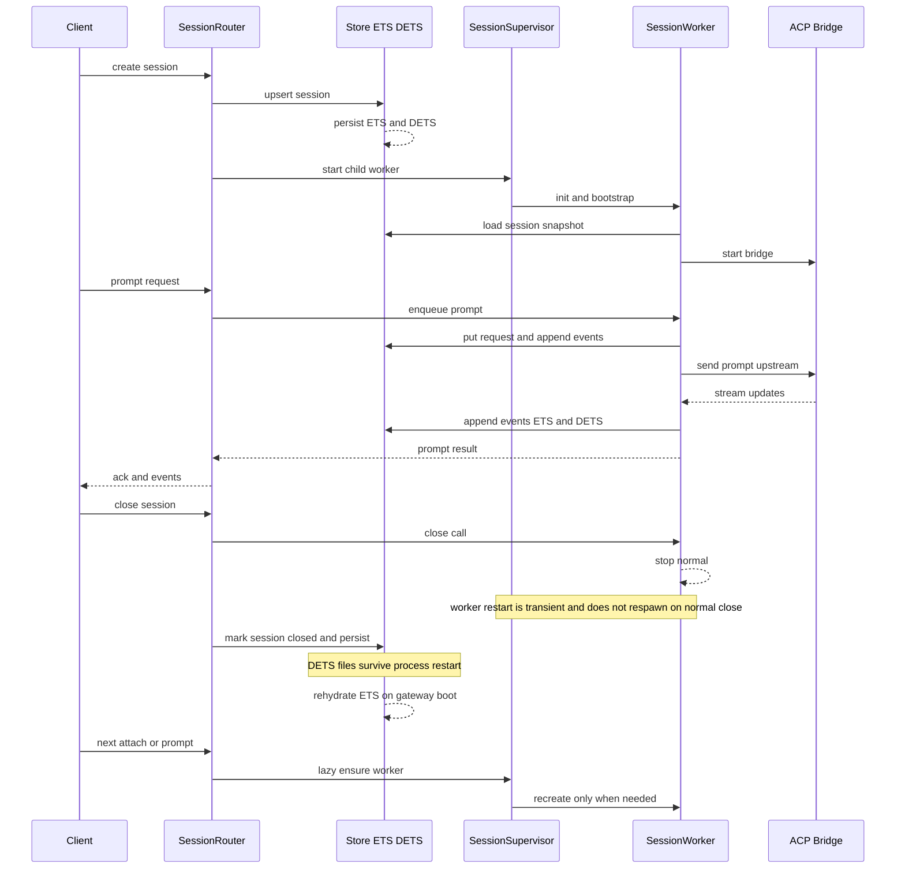

# Hivebeam Gateway Capabilities and Architecture Notes

This document describes what the gateway supports today and what should be added next.
State snapshot date: 2026-02-19.

## Current Support (Implemented)

### Supported agents

- `codex` via `Hivebeam.CodexBridge`
- `claude` via `Hivebeam.ClaudeBridge`

Both are routed through `provider` on `POST /v1/sessions`.

### Tool support by agent

Both supported agents use the same ACP client handler (`Hivebeam.AcpClient`) today.
Supported ACP methods:

- `session/request_permission`
- `fs/read_text_file`
- `fs/write_text_file`
- `terminal/create`
- `terminal/output`
- `terminal/wait_for_exit`
- `terminal/kill`
- `terminal/release`

### Sandbox support

Implemented at multiple layers:

- Session creation gate (`session_router.ex`)
- Worker approval gate (`session_worker.ex`)
- ACP execution gate (`acp_client.ex`)

Config surface:

- `HIVEBEAM_GATEWAY_SANDBOX_ALLOWED_ROOTS`
- `HIVEBEAM_GATEWAY_SANDBOX_DEFAULT_ROOT`
- `HIVEBEAM_GATEWAY_DANGEROUSLY`
- Per-session `dangerously` create-session flag

### Runtime topology

- Single gateway node/process supervision tree
- Dynamic session workers
- Local durable event/request/session store (DETS + ETS)

### Runtime details: store (DETS + ETS)

Current store implementation (`Hivebeam.Gateway.Store`) uses both ETS and DETS:

- ETS is the hot in-memory index for reads/writes during runtime.
- DETS is the local on-disk persistence layer.

Files created under `HIVEBEAM_GATEWAY_DATA_DIR` (default `~/.config/hivebeam/gateway`):

- `session_index.dets`
- `event_log.dets`
- `request_index.dets`

Persistence behavior today:

- On boot, gateway rehydrates ETS from DETS.
- Session, event, and request writes are persisted to DETS during normal operation.
- DETS is opened with `auto_save: 1000` (periodic flush) and closed on normal termination.
- Data persists across gateway restarts until files are deleted/replaced.

Retention behavior today:

- Events are bounded by `HIVEBEAM_GATEWAY_MAX_EVENTS_PER_SESSION` (older events are pruned).
- Sessions and request records currently have no TTL-based purge.
- Closing a session marks it as closed, but does not delete persisted records.

### Runtime details: dynamic session workers

Session workers are managed by `Hivebeam.Gateway.SessionSupervisor` (`DynamicSupervisor`) and created per gateway session key.

Lifecycle behavior today:

- `SessionRouter.create_session/1` creates a persisted session, then starts a worker.
- `SessionRouter.ensure_worker/2` lazily creates/reuses the worker for prompt/attach/cancel/approve flows.
- Worker process name is registry-based and keyed by session key.
- Worker loads persisted session state from Store on init.
- Worker manages per-session queue/in-flight state, approval state, and bridge status sync.

Recovery/restart behavior:

- If gateway restarts, Store rehydrates from DETS and workers are recreated lazily as clients interact.
- Worker child spec uses `restart: :transient`.
- A worker stopped with normal exit during session close is not restarted automatically.

### Runtime sequence diagram

### Existing client surfaces

- Gateway HTTP + WebSocket API (`/v1`)
- Elixir SDK (`hivebeam-client-elixir`)
- Phoenix example app (`hivebeam-phoenix-example-app`)

## Not Supported Yet (And Recommendations)

### Gateway-level custom tools / skills creation

Current: not supported as a first-class gateway feature.

Recommendation:

- Keep tool/skill definition out of the core gateway at first.
- Add a policy-controlled "MCP registry/proxy" layer before allowing dynamic tool registration.
- Require signed manifests, versioning, and capability allowlists per team/workspace.

### Multiple node gateway / clustering

Current: no real distributed session routing/replication/HA.

Recommendation:

- Start with single-node gateway (Level 0).
- Add Hub + Worker topology (Level 1) only when you need one endpoint for many machines.
- Add HA hub (Level 2) only for multi-user production reliability needs.

## Agent Extensibility: ACP vs per-agent modules

ACP is the transport protocol, but provider-specific bootstrapping still differs (mode IDs, metadata, capability quirks).

So the practical model is:

- ACP core remains shared.
- Small provider adapters remain necessary for:
  - command/bootstrap differences
  - mode enforcement mappings
  - provider-specific metadata quirks

This means adding a new provider is mostly transparent at the protocol layer, but still needs a thin provider module.

## Policy/Compliance Controls

### What exists now

- Auth token gate (bearer)
- Approval mode enforcement (`ask/allow/deny`)
- Provider mode enforcement (`session/set_mode`)
- Path sandboxing for `cwd` and fs/terminal paths
- Session/event/request logs in gateway storage

### What does not exist yet

- Prompt PII/secret redaction/classification
- Model/provider audit ledger with cost attribution
- Tool allowlists/denylists per team/policy profile
- Team quotas and weighted fairness
- Dynamic policy routing by task class and budget
- Global "approved capability profile" enforcement across all clients/editors

### Recommended implementation model

Introduce an ACP "conductor" policy pipeline inside the gateway:

1. Inbound request classification (prompt/tool/session metadata)
2. Policy evaluation (allow/deny/rewrite/redact/route)
3. Provider routing decision
4. Audit event emission (with cost accounting hooks)
5. Execution

## API/Auth provenance via ACP

Can ACP tell "API key call vs provider plan/auth" reliably?

- Usually no, not in a portable way across providers.
- Treat it as provider-specific metadata, not protocol-guaranteed.
- If required, add explicit attestation fields at gateway ingress and enforce signed client identity.

## Observability and tracing

Should the gateway allow pluggable logs/trace modules? Yes.

Recommended:

- Emit structured telemetry events for:
  - session lifecycle
  - prompt lifecycle
  - tool calls and denials
  - provider/mode routing decisions
  - token/cost metrics (when available)
- Add a behavior-based sink interface (e.g. OTEL, JSONL, Kafka).

## Supervision and reliability

Current supervision is already BEAM-native and good for a single node.

Next reliability improvements:

- Explicit circuit-breaker/backoff controls per provider bridge
- Bounded queues per session/team
- Store health monitoring and compaction tasks
- Graceful restart semantics for long-lived sessions

## Product Surface Recommendations

### Should we ship robust app clients beyond SDKs?

Yes, but sequence it:

1. Harden SDK contracts first (Elixir + TypeScript)
2. Keep Phoenix example app as an operator/admin console seed
3. Add mobile/browser clients only after websocket auth/session semantics are stable

### Should we integrate external channels (WhatsApp/Telegram)?

Possible, but this is application-layer scope.
Gateway should expose stable APIs and policy hooks; channel adapters should live in separate services.

### Should gateway have chat/config UI?

- Chat UI: already demonstrated in Phoenix example app.
- Config UI: useful for enterprise, but should come after policy, audit, and multi-tenant primitives exist.

## Advanced Scheduling/Routing Features

These are not implemented yet:

- Per-team quotas and fairness shaping
- Dynamic model routing (cheap/default/premium/fallback)
- Compliance routing (approved provider lists by team/repo)
- Multi-agent gated pipelines (implement -> test -> security -> PR approval)

Recommended order:

1. Policy engine + audit logs
2. Team identity + quota model
3. Router with policy-aware provider/model selection
4. Multi-agent orchestration primitives

## Distributed Architecture Ladder

### Level 0: single-node gateway (recommended start)

- One machine, one user/workspace
- ACP over stdio + optional websocket
- Local persistence

### Level 1: hub + workers (first meaningful distribution step)

- Hub handles auth/discovery/routing/policy
- Worker on each repo machine executes ACP/tools
- Workers maintain outbound connections to hub

### Level 2: HA hub

- Multiple hubs behind LB
- Shared session state store
- Sticky routing by `session_id`

### Level 3: full cluster

- Only for high-scale trusted-network deployments with real low-latency shared-state needs

For this project now: Level 0 first, then Level 1 when you need one endpoint for many boxes.
